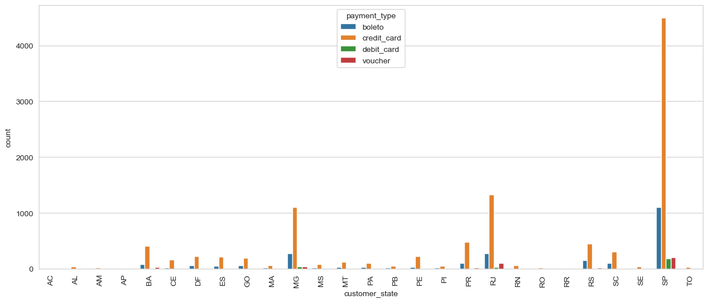

# Machine Learning project: CUSTOMER SEGMENTATION 
### By Martina Serandrei, Giulia Macis, Francesco Capo

## Introduction
The aim of our project is to analyze the data provided by a very big company about the customers of its Brazilian subsidiary, to be able to build an email campaign based on a customer segmentation.
The clustering is performed following the RFM analysis, where R stands for Recency, F for Frequency and M for Monetary value.
In order to accomplish our mission, we followed these steps:
- Exploratory Data Analysis (EDA) with the visualization of data.
- RFM analysis
- Implemented four clustering algorithms

Only after a deep analysis of their performance and outcomes we presented the clusters.

## Methods
In order to complete in the best way our analysis we chose to use four different algorithms, Kmeans Clustering, Hierarchical clustering, Gaussian Mixture Model and Birch model.
We chose these clustering techniques since each of this method provides a different output, and so we will have a different segments.

- Our first implementation was the **Kmeans**, this method groups similar kinds of datapoints in form of clusters according to the similarity between them.
 It uses the elbow method technique in order to find the optimal amount of clusters, this will find the right amount of centroids that will determine our clusters.
 We chose to use it because it is able to understand, in a pretty efficient way, the different features of each cluster in order to maximize the profits.

- Hierarchical clustering groups data based on their similarities: we firstly identified the optimal amount of clusters, we did so by plotting a dendrogram, which shows the hierarchical relationship between clusters.
  This method also finds the best amount of clusters and then segments the data.

- The Gaussian Mixture Model works by assuming that all data points are generated from a mixture of a finite number of Gaussian distributions with unknown parameters.
    It is helpful when we represent a smaller population preference (customers), in respect of the overall population preference, (total customers).

- Birch model (Balanced Iterative Reducing and Clustering using Hierarchies), is very useful because it helps to reduce the computational time by creating a tree structure and assigning each data point to the most relevant cluster. 
  It is very convenient since in most cases it requires only one scan of the dataset, this improves our memory and time consumption, but still giving us a good interpretation.

Is worth to note that in order to compute and plot our clusters we needed to import some libraries as:

    pandas as pd
    matplotlib.pyplot as plt
    seaborn as sns
    scipy.cluster.hierarchy as sch

  Furthermore, from this library we imported some specific functions, for instance:
  - from numpy import where, unique | returns elements of an array based on a condition, returns the unique elements an array.
  - from sklearn.preprocessing import StandardScaler  **|**  we need it to standardize our variables.
  - from sklearn.cluster import KMeans, AgglomerativeClustering, Birch | clustering algorithms.
  - from sklearn.mixture import GaussianMixture | it was needed to compute the Gaussian Mixture.
  - from sklearn.metrics import silhouette_score, calinski_harabasz_score, davies_bouldin_score | it computes the metrics results.
  - from IPython.display import display | we used it to display the dataframes in a tidy format.

### Experimental design
#### EDA:
In order to deeply understand the dataset before actually working on it, we performed an analysis starting from the visualization of the data and some data exploration.
For example, we firstly printed the shape of the dataset, and then we used the `describe()` function to compute some useful descriptive statistics which summarize the central tendency, dispersion, and shape of a dataset’s distribution.
    
Dataset shape:(13801, 26)

We have a quite big dataset with many variables as well, so it might be useful to discard the information we don't need for the clustering.
As a matter of fact we created a new dataframe, called csdv_df_new, excluding _product_category_name_, _product_name_length_ e _product_description_length_.

Successively, we proceeded with the data cleaning:
- We checked for null values and duplicate rows, and we deleted them. We found out that the dataset is quite clean since it has only a few duplicate rows and zero null values.

Then we started analyzing the variables of the dataset by plotting the correlation among the numerical variables through a **correlation heatmap**, which is useful to understand which variables are related to each other and the strength of their relationship. In the cells of the heatmap, the strength of the relationship is indicated with positive values if there is a positive correlation, and negative values if a negative correlation is present.
In our case we saw that basically our numeric variables are the ones related to the payments or the orders; in particular, we can see that there is a high correlation between _payment_value_ and the _price_, while we have  a negative correlation, with _order_item_id_ and the _price_ since _order_item_id_ stands for the number of items for each order, and the _price_ means the price of each item. 
It is easily understandable from the description that the number of items that we place in an order cannot influence in any way the price of an item. We can make the same reasoning for the relationship between _order_item_id_ and _freight_value_.

Furthermore, we decided to plot some of the features which might be interesting to correlate. One of these could be the number of orders derived from each Brazilian federate state with a bar plot; so, we counted (with `.size()`) how many order per state by applying the pandas `.groupby()` function.

 

What we can notice is a large majority of orders coming from São Paulo state, which is the most important state by population and this could be a reason for it.

Another intriguing relationship to investigate was how many orders are paid using a certain payment type per state. And as we can see from the graph, the most used payment type in general is the credit card and then boleto is the second most used method to pay. 
The last aspect we wanted to look into was the number of order made in each month. The result revealed that from April to August the subsidiary got a lot of orders with a peak in May, whereas in the rest of the months they were very few.

A fundamental step for the initial analysis was studying and visualizing the outliers to understand if they needed to be removed from the dataset, or they could bring relevant information to the customers' segmentation. We decided to handle the issue by using a pair plot, thanks to which we could detect them; in particular the majority belong to _payment_value_ , but visualizing them, made us realize that even if some values are unusual, they still need to be considered because maybe they are customers that could have been included in the email campaign.
Finally, before diving deeply into the data manipulation, we performed an encoding for categorical variable into quantitative variables, so that they could be taken into consideration in the analysis. We simply used the pandas function `.get_dummies()`.

As we said before our segmentation follows the RFM analysis:
It is a behavior-based technique used to segment customers by examining their transaction history focusing on the following:

- Recency: how recently a customer has purchased.
  It is expressed in days,  meaning that high recency corresponds to orders made a long time ago. 

- Frequency: how often they purchase

- Monetary value: how much the customer spends.

It is the most suitable technique since it helps to identify customers who are more likely to respond to promotions, which is the ultimate goal of the targeted email campaign.
For example, customers who recently made a purchase will still have the product on their minds, so they are more likely to buy again especially if they are pulled by the marketing campaign.
Additionally, first-time customers, with a low frequency may be good targets for the marketing campaign to convert them into more frequent customers.
To carry out the techniques we first computed all the metrics, and then we stored them in a dataframe called *score_dataframe*.
Since the scales of the 3 variables are substantially different, we thought it would be necessary to standardize the results in order to work with uniform values.
At this point having all the data we needed, we started implementing the clustering methods.

The first method we implemented was the Kmeans algorithm, for which we needed to compute the elbow method in order to find the right cluster number. As result, we found two numbers, 4 and 5.
The best way to  decide which one to use was to compare their plots and their scores. Finally, we decided that the best one is the one with 4 clusters since the graph is clearer and the scores are optimized in a better way.

For the Hierarchical Clustering we computed the number of cluster with the help of the dendrogram. After plotting it, we could see that also in this case the right choice for clusters was 4.

Finally, for the GMM and the Birch we put 4 clusters for the sake of consistency and to be able to compare it with the previous methods. 

## Results 
After implementing all the clustering methods, we carried out an overall analysis of the outcomes obtained, and of the performance of the algorithms.

We visualized the clusters through 3D scatter plots, but we also computed empirical results about the characteristics of the clusters obtained.
Comparing both we can describe the clusters:
for example the clusters obtained in the **birch model** and **kmeans model** are very similar to each others (despite the order of their labels).

- **The first cluster** represents inactive customers that have made a few purchases typically a long time ago.
- **The second one** represents active customers that have made purchases many times, also recently, and have spent a fair amount on their purchases.
- **The third cluster** represents new customers that have purchased very recently (they have in fact the lowest recency value) and have not spent much, because they haven’t made frequent transactions yet.
- Finally, **the fourth cluster** represents usual/ loyal customers, they shop really frequently and spend a large amount of money on their orders (they have the highest monetary value). 

The **hierarchical** clusters are pretty similar to the kmeans and birch clusters as well, the slight differences are that:
in the hierarchical clusters the inactive customers have a lower recency and a lower frequency,
the active customers  have a lower monetary value and higher recency and
the new customers have a higher recency and lower frequency.

The **Gaussian method** instead returns different clusters,
as a matter of fact cluster 4 corresponds to the union of the kmeans clusters number 4 and 2, meaning that there is no distinction between active customers and loyal customers. Additionally, three really similar clusters are created, all three contain customers with a high recency, low frequency
and low monetary value making them not useful for our ultimate goal.

The inappropriateness of this method can be proven by the scores that quantify the performance of the algorithms.

We decided to calculate 3 of these scores:
1. The silhouette score: 

    It measures how similar a value is to its own cluster (cohesion) compared to other clusters (separation). The score ranges from −1 to +1, where a high value indicates that the datapoint is well-matched to its own cluster and a low value indicates poorly matched to its cluster.

2. Calinski and Harabasz score:

   It measures the sum of between-cluster dispersion and of within-cluster dispersion.
   The higher the value the better the clusters.
   
3. Davies-Bouldin score.

    The score is the average similarity measure of each cluster with its most similar cluster, where similarity is the ratio of within-cluster distances to between-cluster distances.This means that, clusters which are farther apart and less dispersed will result in a better score.
The minimum value is zero, so the lower the score the better the clusters.
      

The results can be a little misleading, for example the birch algorithm has the highest Silhouette score and the lowest Davies-Bouldin score but it has a low Calinski and Harabasz score.
Looking at the plot though we saw that the clusters aren’t homogeneous since the last one contains only one customer implying that this method isn’t the best choice.
Over all we deduce that the best algorithm is k means and the worst is gaussian mixture model, as we already deduced by the visual representations of the clusters.
The reason why it isn’t a good method for our dataset is probably because we have a big dataset with well-defined data, and low noise, so the kmeans method works better even if it's simpler.
Moreover, The GMM method is less sensitive to outliers.
### Conclusion
After the detailed analysis we concluded that the best model is the k means algorithm, therefore the segments obtained are the following four:
-inactive customers
-active customers
-new customers
-loyal customers